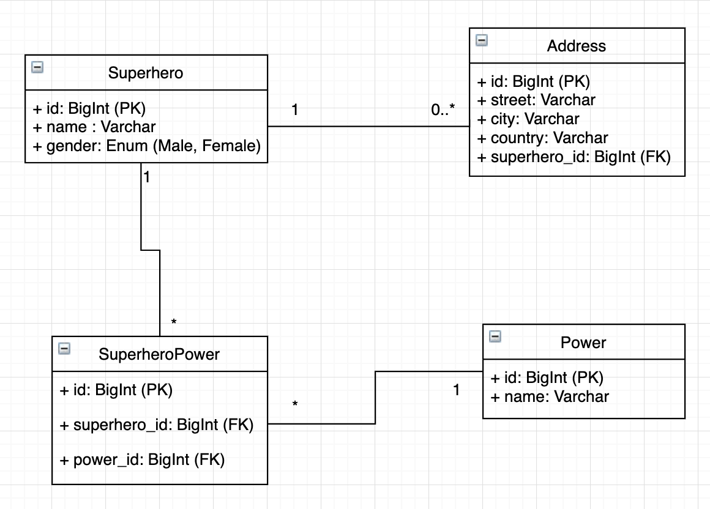

##### ER Schema



##### Run the project.

```
$ docker-compose up  # port 80
```
or 
```
# Installing dependencies.
$ go get github.com/gin-gonic/gin
$ go get github.com/jmoiron/sqlx
$ go get github.com/mattn/go-sqlite3

$ go run main.go     # port 8080
```
